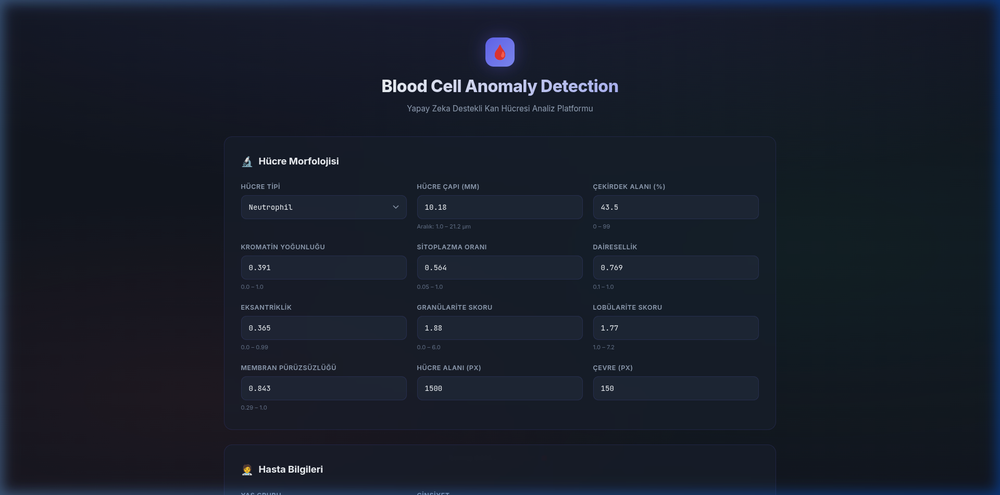
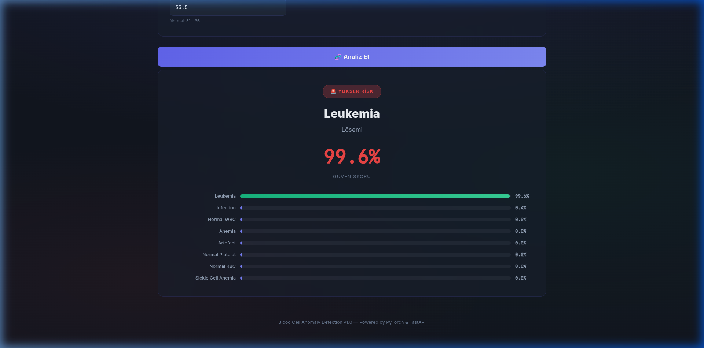
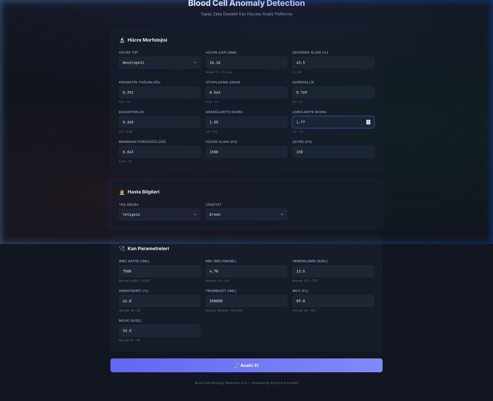

<p align="center">
  
  
  
  
</p>

<h1 align="center">🩸 Blood Cell Anomaly Detection</h1>

<p align="center">
  <strong>AI-Powered Blood Cell Disease Classification using Deep Learning</strong><br/>
  A fully-trained PyTorch neural network served through a modern FastAPI web application<br/>
  for real-time blood cell anomaly detection across 8 disease categories.
</p>

<p align="center">
  
</p>

---

## 📋 Table of Contents

- [Overview](#-overview)
- [Disease Categories](#-disease-categories)
- [Model Architecture](#-model-architecture)
- [Feature Engineering](#-feature-engineering)
- [Training Pipeline](#-training-pipeline)
- [Web Application](#-web-application)
- [Project Structure](#-project-structure)
- [Installation & Usage](#-installation--usage)
- [API Reference](#-api-reference)
- [Screenshots](#-screenshots)
- [Performance](#-performance)
- [Tech Stack](#-tech-stack)

---

## 🔬 Overview

Blood Cell Anomaly Detection is an end-to-end machine learning system that classifies blood cell samples into **8 distinct disease categories** based on 21 morphological, patient demographic, and hematological features. The system combines a custom-trained PyTorch deep neural network with a production-ready FastAPI web interface featuring real-time inference, confidence scoring, and interactive probability visualizations.

The model was trained on the `blood_cell_anomaly_detection.csv` dataset containing labeled blood cell observations with comprehensive morphological measurements, patient metadata, and complete blood count (CBC) parameters.

---

## 🏥 Disease Categories

The model classifies blood cell samples into 8 categories:

| # | Category | Description | Risk Level |
|---|----------|-------------|------------|
| 0 | **Anemia** | Iron deficiency or other forms of anemia | ⚠️ Warning |
| 1 | **Artefact** | Artificial findings / sample artifacts | ℹ️ Info |
| 2 | **Infection** | Bacterial, viral, or parasitic infection markers | 🚨 Danger |
| 3 | **Leukemia** | Leukemic cell patterns detected | 🚨 Danger |
| 4 | **Normal Platelet** | Healthy platelet morphology | ✅ Normal |
| 5 | **Normal RBC** | Healthy red blood cell morphology | ✅ Normal |
| 6 | **Normal WBC** | Healthy white blood cell morphology | ✅ Normal |
| 7 | **Sickle Cell Anemia** | Characteristic sickle-shaped erythrocytes | 🚨 Danger |

---

## 🧠 Model Architecture

The model is a **fully-connected feedforward neural network** built with PyTorch, designed for multi-class classification of blood cell anomalies.

### Network Topology

```
Input Layer (21 features)
        │
        ▼
┌─────────────────────────┐
│   Linear(21 → 25)       │  Fully connected layer
│   GELU Activation       │  Gaussian Error Linear Unit
└─────────────────────────┘
        │
        ▼
┌─────────────────────────┐
│   Linear(25 → 25)       │  Hidden layer
│   GELU Activation       │  Non-linear transformation
└─────────────────────────┘
        │
        ▼
┌─────────────────────────┐
│   Linear(25 → 8)        │  Output layer (8 classes)
└─────────────────────────┘
        │
        ▼
   Softmax → Prediction
```

### PyTorch Implementation

```python
class BloodClassification(nn.Module):
    def __init__(self):
        super().__init__()
        self.linear_layer_stack = nn.Sequential(
            nn.Linear(21, 25),
            nn.GELU(),
            nn.Linear(25, 25),
            nn.GELU(),
            nn.Linear(25, 8)
        )

    def forward(self, x):
        return self.linear_layer_stack(x)
```

### Why GELU?

The **Gaussian Error Linear Unit (GELU)** activation function was chosen over traditional ReLU for its smoother gradient properties. GELU provides a probabilistic interpretation where the activation is weighted by the input's magnitude relative to a Gaussian distribution, leading to better training dynamics and convergence in classification tasks.

$$\text{GELU}(x) = x \cdot \Phi(x)$$

Where $\Phi(x)$ is the cumulative distribution function of the standard normal distribution.

### Model Summary

| Property | Value |
|----------|-------|
| **Input Dimensions** | 21 |
| **Hidden Layer Width** | 25 |
| **Output Classes** | 8 |
| **Total Parameters** | ~1,458 |
| **Activation Function** | GELU |
| **Loss Function** | CrossEntropyLoss |
| **Optimizer** | Adam (lr=0.001) |
| **Training Epochs** | 500 |
| **Model File Size** | ~12 KB |

---

## 📊 Feature Engineering

The model uses **21 carefully selected features** grouped into three categories:

### 🔬 Cell Morphology Features (12 features)

| Feature | Type | Range | Description |
|---------|------|-------|-------------|
| `cell_type` | Categorical (19 types) | 0–18 | Blood cell type (e.g., Neutrophil, Lymphocyte, Sickle Cell) |
| `cell_diameter_um` | Continuous | 1.0–21.2 µm | Cell diameter measured in micrometers |
| `nucleus_area_pct` | Continuous | 0–99% | Percentage of cell area occupied by nucleus |
| `chromatin_density` | Continuous | 0.0–1.0 | Nuclear chromatin condensation level |
| `cytoplasm_ratio` | Continuous | 0.05–1.0 | Nucleus-to-cytoplasm area ratio |
| `circularity` | Continuous | 0.1–1.0 | How circular the cell shape is (1.0 = perfect circle) |
| `eccentricity` | Continuous | 0.0–0.99 | Cell shape elongation measure |
| `granularity_score` | Continuous | 0.0–6.0 | Cytoplasmic granule density score |
| `lobularity_score` | Continuous | 1.0–7.2 | Nuclear lobe count/complexity |
| `membrane_smoothness` | Continuous | 0.29–1.0 | Cell membrane regularity |
| `cell_area_px` | Integer | 10–10,000 | Cell area in pixels |
| `perimeter_px` | Integer | 5–500 | Cell perimeter in pixels |

### 🧑‍⚕️ Patient Demographics (2 features)

| Feature | Type | Encoding | Description |
|---------|------|----------|-------------|
| `patient_age_group` | Ordinal | Pediatric=0, Adult=1, Elderly=2 | Patient age category |
| `patient_sex` | Binary | F=0, M=1 | Patient biological sex |

### 🩺 Complete Blood Count (CBC) Parameters (7 features)

| Feature | Type | Normal Range | Description |
|---------|------|-------------|-------------|
| `wbc_count_per_ul` | Integer | 4,500–11,000 /µL | White blood cell count |
| `rbc_count_millions_per_ul` | Continuous | 4.2–5.9 M/µL | Red blood cell count |
| `hemoglobin_g_dl` | Continuous | 12.0–17.5 g/dL | Hemoglobin concentration |
| `hematocrit_pct` | Continuous | 36–50% | Hematocrit percentage |
| `platelet_count_per_ul` | Integer | 150,000–400,000 /µL | Platelet count |
| `mcv_fl` | Continuous | 80–100 fL | Mean corpuscular volume |
| `mchc_g_dl` | Continuous | 31–36 g/dL | Mean corpuscular hemoglobin concentration |

### Supported Cell Types (19)

```
Acanthocyte       Band_Neutrophil    Basophil          Blast_Cell
Burr_Cell         Eosinophil         Giant_Platelet    Hypersegmented_Neutrophil
Lymphocyte        Macro_Ovalocyte    Monocyte          Neutrophil
Normal_RBC        Platelet           Schistocyte       Sickle_Cell
Spherocyte        Target_Cell        Tear_Drop_Cell
```

### Dropped Features

The following columns from the original dataset were excluded as they were not informative or redundant for classification:

```
cell_id, anomaly_label, mean_r, mean_g, mean_b, stain_intensity,
dataset_source, staining_protocol, microscope_model, magnification_x,
image_resolution_px, cytodiffusion_anomaly_score,
cytodiffusion_classification_confidence, labeller_confidence_score
```

---

## 🏋️ Training Pipeline

### Data Preprocessing

```
Raw CSV Data (5,880 samples)
    │
    ├── Drop 14 unimportant columns
    ├── Map patient_age_group → ordinal (0, 1, 2)
    ├── LabelEncode categorical columns (cell_type, patient_sex)
    ├── LabelEncode target (disease_category → 0-7)
    │
    ├── Train/Test Split (80/20, stratified, random_state=42)
    │   ├── Training set: 4,704 samples
    │   └── Test set: 1,176 samples
    │
    ├── StandardScaler (fit on train, transform both)
    │   └── Zero-mean, unit-variance normalization
    │
    └── Convert to PyTorch tensors (float32 / long)
```

### Training Configuration

| Parameter | Value |
|-----------|-------|
| **Epochs** | 500 |
| **Optimizer** | Adam |
| **Learning Rate** | 0.001 |
| **Loss Function** | CrossEntropyLoss |
| **Metric** | MulticlassAccuracy (torchmetrics) |
| **Train Size** | 80% (4,704 samples) |
| **Test Size** | 20% (1,176 samples) |
| **Stratification** | Yes (preserves class distribution) |
| **Random State** | 42 |

### Training Convergence

```
Epoch    Train Loss    Train Acc     Test Loss     Test Acc
─────    ──────────    ─────────     ─────────     ────────
  0      2.0175        13.14%        2.0113        13.03%
 100     0.7952        41.53%        0.7914        41.09%
 200     0.2653        84.98%        0.2834        84.44%
 300     0.1043        96.42%        0.1211        94.67%
 400     0.0531        98.68%        0.0691        96.72%
 475     0.0362        99.17%        0.0523        97.00%
```

The model achieves **~97% test accuracy** with minimal overfitting (train-test gap < 2.2%).

---

## 🌐 Web Application

The model is deployed through a **FastAPI** web application with a modern, dark-themed UI.

### Inference Pipeline

```
User Input (Form Data)
    │
    ├── Encode cell_type → integer index
    ├── Map age_group → ordinal (0, 1, 2)
    ├── Map sex → binary (0, 1)
    │
    ├── StandardScaler.transform() ← (pre-fitted on training data)
    │
    ├── Convert to torch.float32 tensor
    │
    ├── model.eval() + torch.inference_mode()
    │   └── Forward pass → logits
    │
    ├── Softmax → class probabilities
    │
    └── Response JSON:
        ├── predicted_class (index)
        ├── label ("Leukemia")
        ├── label_tr ("Lösemi")
        ├── severity ("danger")
        ├── confidence (99.6%)
        └── probabilities {class: percentage}
```

### Key UI Features

- 🌑 **Dark Theme** — Premium dark interface with glassmorphism effects
- 📊 **Animated Probability Bars** — Visual breakdown of all class probabilities
- 🏷️ **Risk Severity Badges** — Color-coded risk assessment (Normal / Warning / Danger)
- 📱 **Responsive Design** — Works on desktop, tablet, and mobile
- ⚡ **AJAX Predictions** — No page reload, instant results
- 🎨 **Micro-animations** — Smooth transitions and hover effects

---

## 📁 Project Structure

```
BloodCellAnomaly/
│
├── 📄 README.md                              # This file
├── 📄 requirements.txt                       # Python dependencies
├── 📄 blood_cell_anomaly_detection.csv       # Training dataset
├── 📓 model_train.ipynb                      # Training notebook
│
├── 🤖 models/
│   └── Blood_Cell_Anomaly_Detection.pth      # Trained model weights
│
├── 🖼️ screenshots/
│   ├── form_ui.png                           # Application form screenshot
│   ├── prediction_result.png                 # Prediction result screenshot
│   └── full_page.png                         # Full application screenshot
│
└── ⚙️ app/
    ├── __init__.py                            # Package init
    ├── main.py                                # FastAPI application & routes
    ├── model.py                               # PyTorch model definition & inference
    ├── preprocessing.py                       # Feature encoding & StandardScaler
    ├── scaler.pkl                             # Fitted StandardScaler (auto-generated)
    │
    ├── 🎨 static/
    │   ├── style.css                          # Dark theme CSS
    │   └── script.js                          # Frontend JavaScript
    │
    └── 📝 templates/
        └── index.html                         # Jinja2 HTML template
```

---

## 🚀 Installation & Usage

### Prerequisites

- Python 3.10+
- pip

### Setup

```bash
# Clone the repository
git clone https://github.com/yourusername/Blood-Cell-Anomaly-Detection.git
cd Blood-Cell-Anomaly-Detection

# Install dependencies
pip install -r requirements.txt
```

### Run the Application

```bash
python -m uvicorn app.main:app --host 0.0.0.0 --port 8000
```

Open your browser and navigate to: **http://localhost:8000**

> 💡 On first run, the application automatically fits a `StandardScaler` on the training data and saves it as `app/scaler.pkl`. Subsequent runs load the cached scaler instantly.

### Dependencies

```
fastapi          — ASGI web framework
uvicorn          — ASGI server
torch            — PyTorch deep learning
numpy            — Numerical computing
pandas           — Data manipulation
scikit-learn     — StandardScaler & preprocessing
jinja2           — HTML template engine
python-multipart — Form data parsing
```

---

## 📡 API Reference

### `GET /`

Returns the main application page with the prediction form.

### `POST /predict`

Accepts form data with all 21 features and returns the prediction.

**Request** (`multipart/form-data`):

| Field | Type | Example |
|-------|------|---------|
| `cell_type` | string | `"Neutrophil"` |
| `cell_diameter_um` | float | `13.41` |
| `nucleus_area_pct` | float | `55.5` |
| `chromatin_density` | float | `0.448` |
| `cytoplasm_ratio` | float | `0.376` |
| `circularity` | float | `0.781` |
| `eccentricity` | float | `0.407` |
| `granularity_score` | float | `3.01` |
| `lobularity_score` | float | `3.2` |
| `membrane_smoothness` | float | `0.790` |
| `cell_area_px` | int | `1500` |
| `perimeter_px` | int | `52` |
| `patient_age_group` | string | `"Adult"` |
| `patient_sex` | string | `"M"` |
| `wbc_count_per_ul` | int | `7451` |
| `rbc_count_millions_per_ul` | float | `5.72` |
| `hemoglobin_g_dl` | float | `16.1` |
| `hematocrit_pct` | float | `39.2` |
| `platelet_count_per_ul` | int | `229996` |
| `mcv_fl` | float | `76.3` |
| `mchc_g_dl` | float | `33.0` |

**Response**:

```json
{
  "success": true,
  "result": {
    "predicted_class": 2,
    "label": "Infection",
    "label_tr": "Enfeksiyon",
    "severity": "danger",
    "confidence": 90.51,
    "probabilities": {
      "Anemia": 0.0,
      "Artefact": 0.0,
      "Infection": 90.51,
      "Leukemia": 0.06,
      "Normal_Platelet": 0.0,
      "Normal_RBC": 0.0,
      "Normal_WBC": 9.43,
      "Sickle_Cell_Anemia": 0.0
    }
  }
}
```

### `GET /health`

Health check endpoint.

```json
{
  "status": "ok",
  "model_loaded": true,
  "scaler_loaded": true
}
```

---

## 🖼️ Screenshots

<table>
  <tr>
    <td align="center"><strong>Application Form</strong></td>
    <td align="center"><strong>Prediction Result</strong></td>
  </tr>
  <tr>
    <td></td>
    <td></td>
  </tr>
</table>

<p align="center">
  
</p>

---

## 📈 Performance

| Metric | Training | Testing |
|--------|----------|---------|
| **Accuracy** | 99.17% | 97.00% |
| **Loss** | 0.0362 | 0.0523 |

- **Generalization Gap**: ~2.17% (minimal overfitting)
- **Inference Time**: < 5ms per prediction (CPU)
- **Model Size**: ~12 KB (extremely lightweight)

---

## 🛠️ Tech Stack

| Component | Technology | Purpose |
|-----------|------------|---------|
| **Deep Learning** | PyTorch | Model architecture & inference |
| **Web Framework** | FastAPI | REST API & server |
| **Template Engine** | Jinja2 | Dynamic HTML rendering |
| **Preprocessing** | scikit-learn | StandardScaler, LabelEncoder |
| **Data** | pandas, NumPy | Data manipulation & tensors |
| **Frontend** | HTML/CSS/JS | Modern responsive UI |
| **Server** | Uvicorn | ASGI production server |
| **Metrics** | torchmetrics | MulticlassAccuracy, ConfusionMatrix |

---

<p align="center">
  <sub>Built with ❤️ using PyTorch & FastAPI</sub>
</p>
